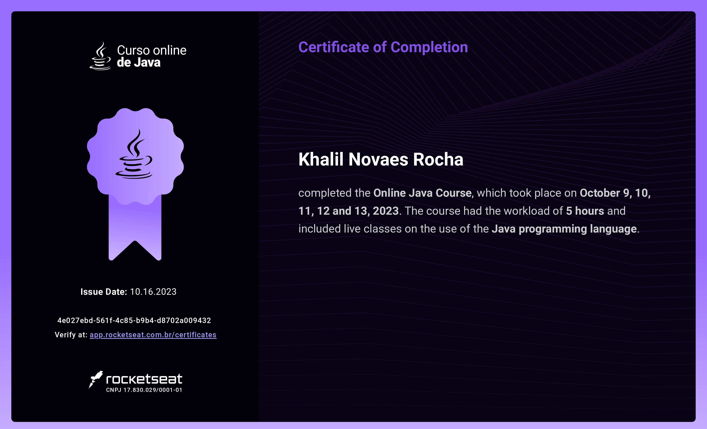

# Todolist-Java
__Construção de uma Todolist utilizando Java e Spring Boot__

        

##Nessa aplicação foi abordado temas como:
* Rest API com ORM (integração BD H2 Database)
* Validação de rotas
* Tratamento e mapeamento de erros
* Criptografia com Bcrypt
* Autenticação de usuario

##Certificado de Conclusão

